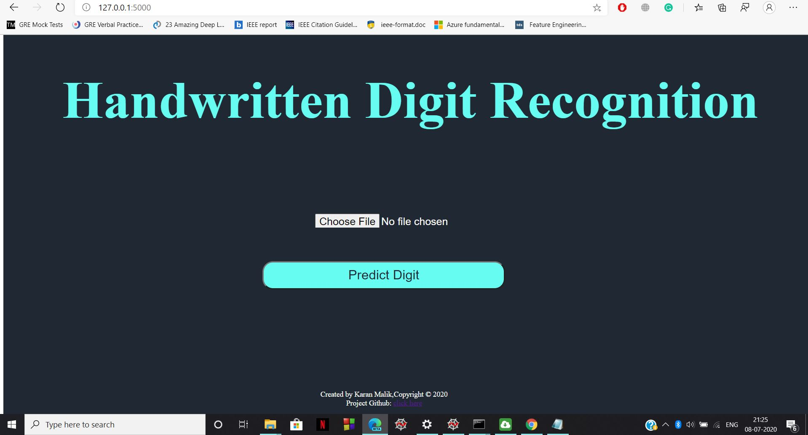
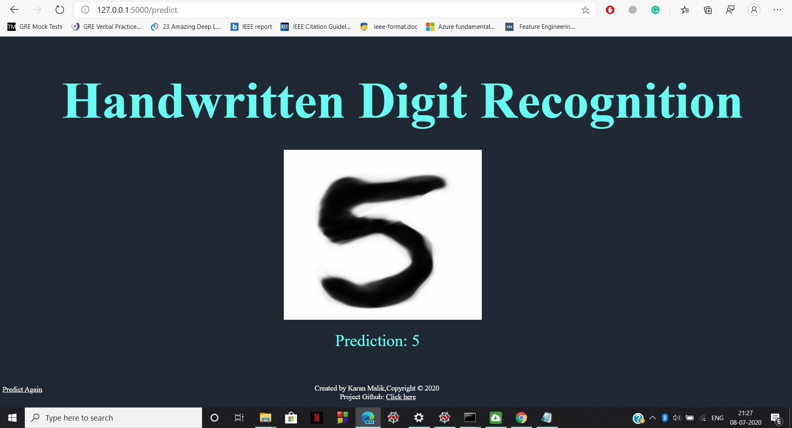

# DigitRecognition
Using Deep Learning to recognize Handwritten Digits (MNIST)

## User Interface

Main Screen



Prediction Screen



## About This Project
This repository contains a self-made Convolutional Neural Network, implemented using Keras, an open source neural network library in Python. It uses this Deep Learning model
to identify the handwritten digit in the image uploaded to it. It is hosted using Flask, a Python Web Development Framework.

It has a **training accuracy of 99.24%** and a **test accuracy of 99.21%**

The complete model is available in 'digit recognition.py'.

## Dataset
The dataset used is the popular MNIST Handwritten Digit Dataset, available on this [link](http://yann.lecun.com/exdb/mnist/). It is also available as a pre-installed dataset
in Keras and can be used as shown in 'digit recognition.py'.

## How to Use

1. Clone this repository onto your system. On Command Prompt, run the following command:

```
git clone https://github.com/Karan-Malik/DigitRecognition.git
```
2. Change your directory to MovieHype:
```
cd DigitRecognition
```

3. Then run the follwing commands to run the application:
```
set FLASK_APP=digit.py
flask run
```

4. Enter the url provided after running the previous commands into your web browser


### The website is now ready to use!

